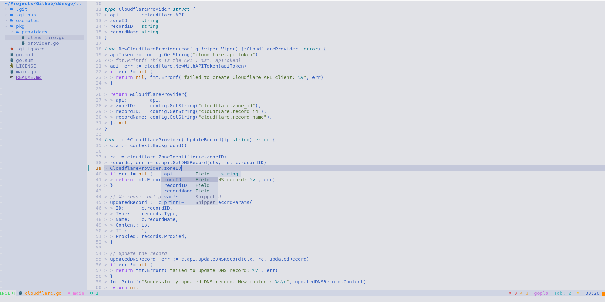

# 🚀 My Awesome Neovim Configuration

Welcome to my Neovim configuration repository! This setup is designed to provide a powerful and efficient editing experience using Neovim, with a focus on modularity and ease of use. This configuration is used by [DamyrFr/ansible-personal-computer](https://github.com/DamyrFr/ansible-personal-computer).

## 📸 Screenshot



## 🌟 Features

- **Plugin Management**: Utilizes [lazy.nvim](https://github.com/folke/lazy.nvim) for efficient and lazy-loaded plugin management.
- **LSP Support**: Incorporates [Mason](https://github.com/williamboman/mason.nvim) for easy Language Server Protocol (LSP) installation and management.
- **Modular Structure**: The configuration is split into three main parts for better organization and maintainability:
  - `plugins`: Defines and installs plugins using lazy.nvim
  - `settings`: Contains all Neovim and plugin-specific settings
  - `lsp`: Configures LSP setup and related settings

## 🛠️ Installation

1. Ensure you have Neovim 0.7+ installed.
2. Back up your existing Neovim configuration if you have one.
3. Clone this repository: `git clone https://github.com/yourusername/neovim-config.git ~/.config/nvim`
4. Launch Neovim and let lazy.nvim install the plugins: `nvim`

## 📁 Structure

```
.
├── init.lua
├── lua
│   ├── plugins.lua
│   ├── settings.lua
│   └── lsp.lua
└── README.md
```

## 🔧 Customization

Feel free to modify any part of the configuration to suit your needs:

- Add or remove plugins in `lua/plugins/init.lua`
- Adjust Neovim and plugin settings in `lua/settings/init.lua`
- Customize LSP configurations in `lua/lsp/init.lua`
